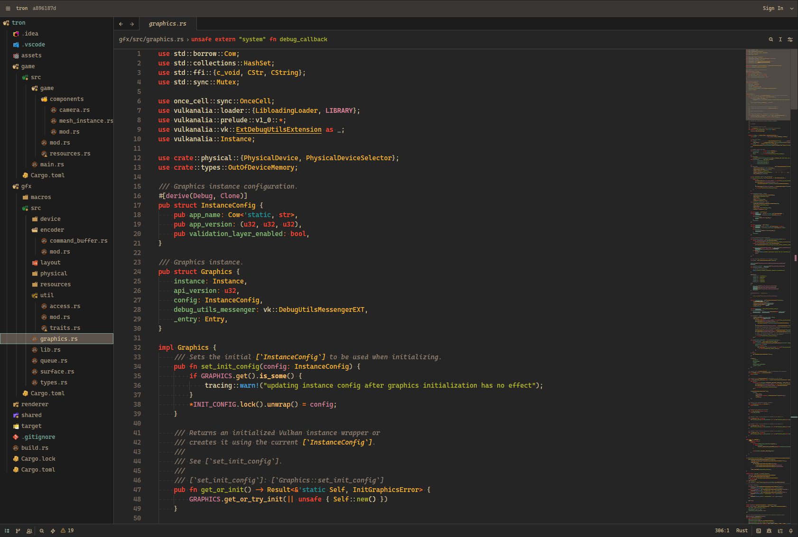

# Gruvbox Material NG

A [VSCode theme](github.com/sainnhe/gruvbox-material-vscode) ported to Zed with some tweaks for readability.



## LSP Settings

This theme is intended to be used with the new LSP semantic tokens highlighting (since version 0.224.0).

```json
{
  "global_lsp_settings": {
    "semantic_token_rules": [
      {
        "token_modifiers": ["deprecated"],
        "strikethrough": true
      },
      {
        "token_modifiers": ["constant"],
        "font_weight": "bold"
      },
      {
        "token_type": "variable",
        "token_modifiers": ["mutable"],
        "underline": true
      },
      {
        "token_type": "parameter",
        "token_modifiers": ["mutable"],
        "underline": true
      },
      {
        "token_type": "parameter",
        "foreground_color": "#d3869bff"
      },
      {
        "token_type": "interface",
        "underline": true
      },
      {
        "token_type": "method",
        "foreground_color": "#ffc66dff"
      },
      {
        "token_type": "builtinType",
        "foreground_color": "#fb4934ff"
      },
      {
        "token_type": "typeParameter",
        "foreground_color": "#20999dff"
      },
      {
        "token_type": "macro",
        "foreground_color": "#4eade5ff"
      }
    ]
  }
}
```

## Credits

- Based on [VSCode theme](https://github.com/sainnhe/gruvbox-material-vscode) by [@sainnhe](https://github.com/sainnhe)
- The color palette is based on [gruvbox](https://github.com/morhetz/gruvbox) by [@morhetz](https://github.com/morhetz)
- The color palette is adjusted by [@sainnhe](https://github.com/sainnhe)
- The icon is designed by [@GulajavaMinistudio](https://github.com/GulajavaMinistudio)
- The material workbench style is designed by [@sainnhe](https://github.com/sainnhe)
- The flat workbench style is designed by [@sainnhe](https://github.com/sainnhe)
- The high contrast workbench style is designed by [@GulajavaMinistudio](https://github.com/GulajavaMinistudio)

## License

[MIT License](./LICENSE)
